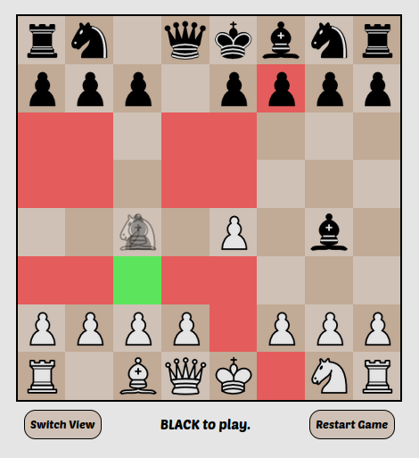
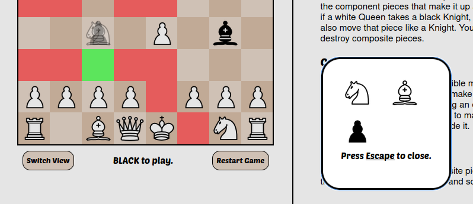

# katamarichess
A custom chess variant that revolves around combining pieces together through captures.

This is a website that is currently not hosted, it can be compiled with `bun run
build` and hosted with `cd dist; http-server` (where `http-server` can be
installed with `npm i http-server -g`)

Instructions on how to play can be found on the website itself, this project is
local-play only.

